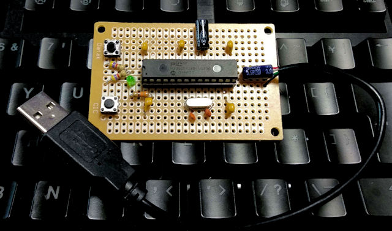

# chipKIT clone for PIC32MX250F128B / PIC32MX230F064B

This article introduces how to create a clone of the open source project "chipKIT" that can develop PIC32 MCUs with Arduino IDE.

"kicad" directory contains a sample circuit diagram for an USB bootloader.

"pic32mx230f" directory contains an example of developing a customized bootloader and an archived built binary for PIC32MX230F064B.

Visit my website for more details: 
[How to develop PIC32MX MCUs with Arduino IDE/VS Code](https://www.tnksoft.com/reading/hardware/pic32/7389.php) 
[How to make chipKIT clone for PIC32MX230F064B](https://www.tnksoft.com/reading/hardware/pic32/7402.php)

## :yen: Donate, please!

## :copyright: License
[Apache License 2.0](https://opensource.org/licenses/Apache-2.0)
